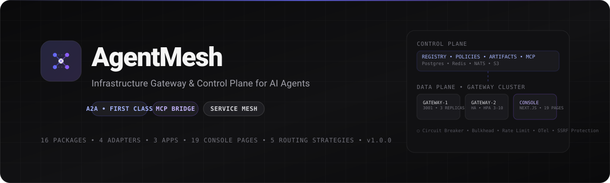
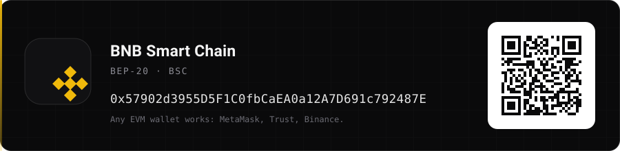
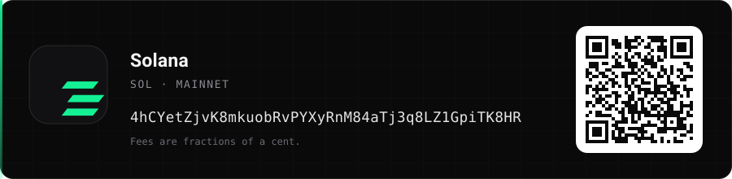
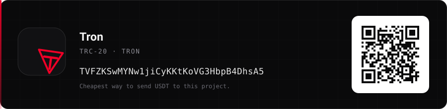

# AgentMesh

> 🌍 **Languages:** [English](./README.md) | [Русский](./README.ru.md) | [中文](./README.zh.md) | [العربية](./README.ar.md) | [فارسی](./README.fa.md) | [Türkçe](./README.tr.md) | [Español](./README.es.md)

[](./docs/assets/agentmesh-banner.svg)

[](./apps/console)
[](./tsconfig.base.json)
[](./apps/gateway)
[](./packages/a2a-protocol)
[](./packages/mcp-bridge)
[](./packages)
[](./README.fa.md)
[](./infra/docker-compose.yml)
[](./DONATE.md)
[](./package.json)

⭐ **[استار بده](https://github.com/mmdverse/agentmesh/stargazers)** اگه مفیده · 💛 **[حمایت از پروژه](#حمایت-و-دونیت)**

_درگاه زیرساخت و صفحه کنترل خودمیزبان برای ایجنت‌های هوش مصنوعی — با A2A درجه یک، MCP bridge، و کنسولی که گراف زنده delegation رو نشون می‌ده._

---

**درگاه زیرساخت و صفحه کنترل تولیدی برای ایجنت‌های هوش مصنوعی**

> API Gateway + Service Mesh + Service Discovery + Message Broker + Observability — مخصوص ورک‌لودهای ایجنتیک.

AgentMesh بین ایجنت‌های خودمختار هوش مصنوعی می‌نشیند و یک لایه زیرساخت مشترک فراهم می‌کند برای Discovery، Routing، Authentication، Authorization، Capability Discovery، Task Delegation، Lifecycle، Streaming، Retries، Timeouts، Circuit Breaking، Load Balancing، Observability، Rate Limiting، Quotas، Tenant Isolation، Policy، Eventing، اجرای Async، تبادل Artifact.

A2A یک پروتکل درجه یک است. هیچ جایگزین اختصاصی نیست. MCP با انتزاع تمیز bridge شده.

**کاملاً رایگان برای استفاده شخصی و تجاری — بدون فایل لایسنس، بدون کلید لایسنس، بدون اشتراک.**

---

## معماری

```
                ┌─────────────────────────────────┐
                │        Control Plane            │
                │  Registry / Policies / AuthZ    │
                │  Artifacts / Messages / Webhooks│
                │  MCP Bridge / Observability     │
                └──────────┬──────────────────────┘
                           │ cached config + NATS
                ┌──────────▼──────────────────────┐
                │          Data Plane             │
                │  Gateway Cluster (stateless)    │
                │  Routing / Streaming / Forward  │
                │  Circuit Breaker / Bulkhead     │
                │  Rate Limit / Tenant Isolation  │
                └──┬────────┬────────┬────────┬───┘
                   │        │        │        │
              Agent A   Agent B  Agent C  MCP Tools
```

**جداسازی Control Plane / Data Plane** — اگر Control Plane موقتاً در دسترس نباشد، Data Plane با کانفیگ کش شده (Redis) ادامه می‌دهد. Gateway افقی scale می‌شود بدون bottleneck مرکزی.

**استک:** PostgreSQL (منبع حقیقت با fallback حافظه)، Redis (کش، سلامت، rate limiting)، NATS JetStream (event bus + صف تسک با fallback)، S3 سازگار (آرتیفکت، MinIO برای لوکال).

### ساختار ریپو

```
apps/
  gateway/        # Data Plane - Fastify, stateless, 3+ رپلیکا, HPA
  control-plane/  # Control Plane - Registry, Tasks, Artifacts, Messages, Webhooks, MCP, Observability
  console/        # وب کنسول - Next.js 14, Tailwind, shadcn/ui, TanStack Query/Table, React Flow
packages/
  a2a-protocol/   # تایپ‌های A2A، اعتبارسنجی، پارسر Agent Card
  routing/        # موتور مسیریابی + 5 استراتژی round_robin, weighted, least_loaded, latency_aware, capability_match
  tasks/          # چرخه حیات تسک، ماشین حالت، درخت delegation
  reliability/    # CircuitBreaker, Bulkhead, retry, timeout, Deduplicator, Idempotency
  identity/       # احراز هویت ApiKey, JWT, OIDC, mTLS, Workload, Composite
  authorization/  # موتور Policy، RBAC/ABAC، DelegationManager با جلوگیری از escalation
  ... 16 پکیج + 4 آداپتر
```

---

## شروع سریع

### پیش‌نیازها

- Node.js 20+, pnpm 9+
- Docker & Docker Compose
- اختیاری: kubectl, helm

### 1. کلون و نصب

```bash
git clone https://github.com/mmdverse/agentmesh
cd agentmesh
pnpm install
```

### 2. اجرای زیرساخت

```bash
pnpm docker:up
# Postgres :5432, Redis :6379, NATS :4222 (مانیتور :8222), MinIO :9000, MinIO Console :9001
```

### 3. کانفیگ

```bash
cp infra/.env.example .env
# برای dev مقدارهای پیش‌فرض با fallback حافظه کار می‌کنند
```

### 4. اجرای Dev

```bash
pnpm dev
# gateway -> http://localhost:3001
# control-plane -> http://localhost:3002
# console -> http://localhost:3000
```

### 5. چک سلامت

```bash
curl http://localhost:3001/health
curl http://localhost:3002/health
curl http://localhost:3000/
```

---

## ویژگی‌ها

### A2A به عنوان پروتکل درجه یک

- Agent Cards: کش (Redis)، اعتبارسنجی (Zod)، ردیابی ورژن، ابطال، امضا، trust policies، کارت‌های عمومی/خصوصی
- حالت‌های Discovery: Direct URL, Well-Known, Local Registry, Enterprise Registry, DNS/Service Discovery, Dynamic, Manual
- پشتیبانی: Skills, Capabilities, Security Schemes, Messages, Tasks, Artifacts, Streaming (SSE), Push Notifications, Cancellation, Context Identifiers, Extensions

### رجیستری ایجنت

ذخیره: Agent ID, Name, Description, Organization, Version, Endpoints, Skills, Capabilities, Security Schemes, Health, Region, Tags, Trust Status. رنکینگ قابل تنظیم با پلاگین RoutingStrategy — بدون رنکینگ سخت‌کد AI.

### ورژن‌دهی

چند ورژن: CodeAgent v1, v2, v3. استراتژی‌ها: latest, stable, specific, minimum, canary, max_satisfying (semver range `^1.0.0`). ورژن‌دهی per-tenant.

### چند مستأجری

```
Organization
  +-- Projects
       +-- Agents, Tasks, Policies
```

ایزولاسیون سخت — عدم تطابق org → 403. استخراج از هدرهای `X-Organization-Id`, `X-Project-Id`, JWT.

### ارکستریشن تسک

`SUBMITTED → WORKING → INPUT_REQUIRED/AUTH_REQUIRED → COMPLETED/FAILED/CANCELED/REJECTED/TIMEOUT`. حالت پایدار، درخت delegation با محدودکننده fan-out (10) و عمق 10. گراف زنده با React Flow.

### قابلیت اطمینان (سیستم‌های توزیع شده تولیدی)

Retries با exponential backoff + jitter، Deadlines، Circuit Breakers CLOSED/OPEN/HALF_OPEN، Bulkheads، Idempotency 24ساعت، Deduplication، بدون retry کور.

### امنیت (مدل تهدید پیاده‌سازی شده)

- ایجنت مخرب، ایجنت هک شده، کارت مخرب، جعل هویت، replay، hijacking، confused deputy، SSRF (لیست مجاز URL، بلاک IP خصوصی 10./192.168./172.16-31./127./localhost، فقط https در prod)، سوءاستفاده webhook، دور زدن مجوز، فرار مستأجر، دسترسی آرتیفکت، تزریق پیام، payload بزرگ، DoS، retry storms، نشت credential، اکستنشن مخرب، gateway هک شده.

### احراز هویت و مجوز

ApiKey, JWT (jose), OIDC (JWKS), mTLS, Workload Identity, Composite. Policy با effect allow/deny، glob matching، شرایط trustLevel/org، delegation با scopes/audience/expiration/chain/revocation و جلوگیری از escalation.

### پیام‌رسانی، آرتیفکت، MCP Bridge

پیام‌ها sync/async/streaming با traceId. آرتیفکت‌ها در S3 با checksum sha256، presigned URL، retention. MCP Tool → A2A Skill، MCP Server → A2A Card، A2A Skill → MCP Tool.

### Event Bus و Push Notifications

رویدادها: agent.registered, task.created/completed/failed, message.sent, artifact.created, policy.denied, webhook.delivered. NATS JetStream stream AGENTMESH با fallback حافظه. Webhook امضا شده HMAC sha256، retry، dead-letter، SSRF protection.

### محدودیت نرخ و مشاهده‌پذیری

چندبعدی: org 500/s, project 200/s, agent 50/s, IP 100/s, global 1000/s. Token bucket, sliding window. OTel tracing User→Agent→Tool، متریک latency, errors, retries.

### کنسول وب

Next.js 14، 19 صفحه: Overview, Agent Registry, Agent Details, Skills, Tasks, Task Detail, Live Task Graph (React Flow realtime)، Messages, Artifacts, Routes, Policies, Organizations, Projects, Credentials, Security Events, Telemetry, Health, Configuration.

---

## API

```
/v1/agents - لیست با فیلتر skill/capability/version/region + tenant
/v1/agents/discover - discovery ترکیبی با best نسخه‌محور
/v1/agents/versions/:name - لیست ورژن‌ها
/v1/tasks - ساخت با delegation + fan-out + bulkhead + circuit breaker
/v1/tasks/:id/graph, /stream (SSE)
/v1/artifacts - چرخه حیات S3
/v1/messages, /webhooks, /mcp/servers, /observability
/v1/health, /info
```

---

## دیپلوی

### Docker Compose (سینگل نود + کلاستر کوچک)

```bash
pnpm docker:up   # postgres, redis, nats, minio, control-plane, gateway x2 HA, console
pnpm docker:logs
pnpm docker:down
```

### Kubernetes (کلاستر سازمانی)

```bash
kubectl apply -f infra/k8s/
# Namespace + ConfigMap + Secret, Postgres PVC 10Gi, Redis 5Gi, NATS 5Gi, Gateway 3 رپلیکا HPA 3-10 CPU 70%, Control-Plane 2, Console, Ingress
```

### Helm

```bash
helm install agentmesh infra/helm/agentmesh -n agentmesh --create-namespace
helm upgrade agentmesh infra/helm/agentmesh -n agentmesh
```

بدون K8s برای dev لوکال — fallback حافظه برای همه infra.

---

## تست

```bash
pnpm test
```

Unit, Integration, A2A Conformance, MCP Bridge, Routing, Task Lifecycle, Failure (Agent unhealthy, Gateway/NATS/Redis/DB failover, duplicate messages/webhooks, latency), Load, Security (auth, policy, SSRF, tenant breakout), Multi-Tenant, Fuzz, Property-Based.

---

## SDK

```ts
const mesh = new AgentMeshClient({
  endpoint: "http://localhost:3002",
  gatewayEndpoint: "http://localhost:3001",
});
const agents = await mesh.discovery.find({ skill: "code-review", versionStrategy: "stable" });
const task = await mesh.tasks.create({
  agentId: agents.agents[0].id,
  message: { text: "این PR رو بررسی کن" },
});
const result = await mesh.tasks.poll(task.task.id);
const artifact = await mesh.artifacts.create({
  contentType: "application/json",
  jsonData: { result },
  taskId: task.task.id,
});
```

**Server SDK:**

```ts
const server = createAgentServer({
  card: { name: "CodeAgent", description: "کد رو بررسی می‌کنه", version: "1.0.0" },
  taskHandler: async ctx => {
    ctx.stream?.({ text: "در حال تحلیل..." });
    return { text: `بررسی شد: ${ctx.message.text}`, state: "COMPLETED" };
  },
});
await server.listen();
```

---

## حمایت و دونیت

AgentMesh کاملاً رایگان و بازه — بدون قید. یک نفر نگهداری می‌کنه و دونیت‌ها میره برای هزینه‌های واقعی زیرساخت: سرورها، اندازه‌گیری، ترافیک تولیدی.

### آدرس‌ها

کارت را با اپ کیف پول اسکن کن، یا از دکمه کپی زیرش استفاده کن. قبل از ارسال آدرس را در کیف پول چک کن — کمترین کارمزد روی Solana و Tron.

[](./docs/assets/donate/donate-bitcoin.svg)

```
bc1q36uzqlkaav3lkscknhemcem0lcjtkhepdqckul
```

[](./docs/assets/donate/donate-bnb.svg)

```
0x57902d3955D5F1C0fbCaEA0a12A7D691c792487E
```

[](./docs/assets/donate/donate-solana.svg)

```
4hCYetZjvK8mkuobRvPYXyRnM84aTj3q8LZ1GpiTK8HR
```

[](./docs/assets/donate/donate-tron.svg)

```
TVFZKSwMYNw1jiCyKKtKoVG3HbpB4DhsA5
```

**آدم پولی نیستی؟** یک تست کیس که fail می‌ده، یک استراتژی روتینگ جدید، یا یک پروفایل تأخیر اندازه‌گیری شده از بیشتر PRها باارزش‌تره.

---

Made ❤️ by Mohammad @llllxyz — https://t.me/llllxyz

زیرساخت برای آینده ایجنتیک.
