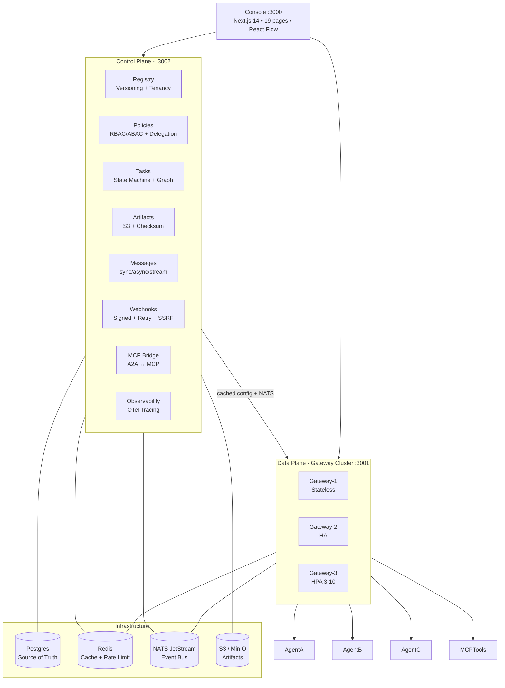

# AgentMesh

> 🌍 **Languages:** [English](./README.md) | [Русский](./README.ru.md) | [中文](./README.zh.md) | [العربية](./README.ar.md) | [فارسی](./README.fa.md) | [Türkçe](./README.tr.md) | [Español](./README.es.md)

[](./docs/assets/agentmesh-banner.svg)

[](./apps/console)
[](./tsconfig.base.json)
[](./apps/gateway)
[](./packages/a2a-protocol)
[](./packages/mcp-bridge)
[](./packages)
[](./README.fa.md)
[](./infra/docker-compose.yml)
[](./DONATE.md)
[](./package.json)

⭐ **[Star it](https://github.com/mmdverse/agentmesh/stargazers)** if it is useful · 💛 **[Support the project](#support-the-project)**

_Self-hosted infrastructure gateway and control plane for AI agents — with A2A as first-class, MCP bridged, and a console that shows the live delegation graph._

---

## Overview

**AgentMesh** sits between autonomous AI Agents and provides the shared layer every agentic system ends up rebuilding: discovery, routing, auth, policy, task orchestration, streaming, reliability, and observability.

**Completely free for personal and commercial use — no license file, no license key, no subscription.**

Three things live in this repository:

|                       | What                                                                                                                                                                                             | Where                |
| --------------------- | ------------------------------------------------------------------------------------------------------------------------------------------------------------------------------------------------ | -------------------- |
| **The gateway**       | Stateless data plane, 3+ replicas, HPA 3-10, circuit breaker, bulkhead, rate limiting, tenant isolation, A2A proxy, streaming                                                                    | `apps/gateway`       |
| **The control plane** | Registry, policies, tasks with delegation tree, artifacts S3, messages, webhooks signed, MCP bridge, OTel tracing                                                                                | `apps/control-plane` |
| **The console**       | 19 pages, live task graph with React Flow, agents, artifacts, telemetry, security events                                                                                                         | `apps/console`       |
| **The packages**      | 16 packages: a2a-protocol, routing (5 strategies), tasks, reliability, identity, authorization, tenancy, versioning, messaging, artifacts, webhooks, mcp-bridge, observability, rate-limit, etc. | `packages/`          |
| **The adapters**      | Postgres (Drizzle), Redis, NATS JetStream, S3 (MinIO/AWS), OIDC                                                                                                                                  | `adapters/`          |
| **The deployment**    | Docker Compose full stack, K8s manifests with PVCs/HPA/Ingress, Helm chart with dependencies                                                                                                     | `infra/`             |

The console and the gateway are not decoration: `pnpm turbo run build --filter=@agentmesh/console` must stay green, health checks must return 200, and an agent registered via `POST /v1/agents` must be discoverable via `GET /v1/agents/discover`.

---

## Architecture



**Control Plane / Data Plane separation** — Data Plane continues with cached config (Redis) if Control Plane is temporarily unavailable. Gateway scales horizontally with no central bottleneck. InMemory fallbacks for all infra, so `pnpm dev` works without Docker.

---

## Feature set

| Area                   | What it does                                                                                                                                                                                                                                                                                                                                                                           |
| :--------------------- | :------------------------------------------------------------------------------------------------------------------------------------------------------------------------------------------------------------------------------------------------------------------------------------------------------------------------------------------------------------------------------------- |
| **A2A first-class**    | Agent Cards caching (Redis), validation (Zod), version tracking, signature verification, trust levels UNTRUSTED/EXTERNAL/VERIFIED/ORGANIZATION/SYSTEM, 7 discovery modes: Direct URL, Well-Known, Local Registry, Enterprise Registry, DNS, Dynamic, Manual                                                                                                                            |
| **Registry**           | Agent ID, Name, Description, Organization, Version, Endpoints, Skills, Capabilities, Security Schemes, Health, Region, Tags, Metadata, Trust Status. Ranking via RoutingStrategy plugins, no hardcoded AI ranking                                                                                                                                                                      |
| **Versioning**         | Multiple versions CodeAgent v1/v2/v3, strategies latest/stable/specific/minimum/canary/max_satisfying (semver `^1.0.0`, `~2.0.0`, `>=1.0.0 <2.0.0`), per-tenant versioning, compatibility rules                                                                                                                                                                                        |
| **Multi-tenancy**      | `Organization → Projects → Agents, Tasks, Policies`. Strict isolation org mismatch → 403, extracted from `X-Organization-Id`, `X-Project-Id`, JWT claims                                                                                                                                                                                                                               |
| **Task orchestration** | `SUBMITTED → WORKING → INPUT_REQUIRED/AUTH_REQUIRED → COMPLETED/FAILED/CANCELED/REJECTED/TIMEOUT`, persistent state, delegation tree fan-out limiter 10 depth 10, live graph via React Flow with real-time updates                                                                                                                                                                     |
| **Reliability**        | Retries exponential backoff + jitter, deadlines/timeouts, Circuit Breakers CLOSED/OPEN/HALF_OPEN per agent, Bulkheads maxConcurrent + queue, Idempotency 24h, Deduplication TTL, no blind retries                                                                                                                                                                                      |
| **Security**           | Threat model implemented: malicious agent, compromised agent, malicious Card, spoofed identity, replay, hijacking, confused deputy, SSRF (block private IPs `10./192.168./172.16-31./127./localhost/169.254.169.254`, only https in prod), webhook abuse, authz bypass, tenant breakout, artifact access, message injection, oversized payloads, DoS, retry storms, credential leakage |
| **Auth**               | Pluggable AuthProvider: ApiKey (`X-API-Key`, Bearer), JWT (jose), OIDC (JWKS), mTLS (CN), Workload Identity, Composite                                                                                                                                                                                                                                                                 |
| **AuthZ**              | Independent subsystem: caller, agent, org, project, skill, task, resource, policy, delegation chain. `deny-overrides-allow`, glob matching, least privilege, delegation scopes subset check against escalation                                                                                                                                                                         |
| **Artifacts**          | Text, JSON, files, images, structured data, S3-compatible (MinIO, AWS S3), checksum sha256, retention, access control private/public/org/project, presigned URLs, cleanupExpired                                                                                                                                                                                                       |
| **Messaging**          | MessageId, sender, receiver, taskId, contextId, sessionId, traceId, correlationId, parentMessageId, sync/async/streaming, transport abstraction                                                                                                                                                                                                                                        |
| **MCP Bridge**         | `A2A Agent                                                                                                                                                                                                                                                                                                                                                                             | AgentMesh | MCP Server`, `MCP Tool → A2A Skill (mcp_{name})`, `MCP Server → A2A Card`, `A2A Skill → MCP Tool (inputSchema)`, protocol concerns separate |
| **Event Bus**          | Events: `agent.registered`, `task.created/completed/failed`, `message.sent`, `artifact.created`, `policy.denied`, `webhook.delivered`. NATS JetStream stream `AGENTMESH`, subjects `agentmesh.>`, retention 24h, durable consumers, fallback InMemory                                                                                                                                  |
| **Webhooks**           | Secure delivery: signed HMAC sha256 `t=timestamp,v1=hmac`, retries 3 default exponential backoff `2^attempt + jitter` max 30s, idempotency, replay protection 5m tolerance, dead-letter, SSRF protection                                                                                                                                                                               |
| **Rate Limiting**      | Multi-dimensional: org 500/s, project 200/s, agent 50/s, identity 100/s, skill 100/s, IP 100/s, global 1000/s. Strategies token_bucket, sliding_window, fixed_window. 429 with Retry-After + X-RateLimit headers                                                                                                                                                                       |
| **Resource Limits**    | maxMessageSize 1MB, maxArtifactSize 100MB, maxConcurrentTasks 100, maxTaskDuration 30m, maxStreaming 1h, maxFanOut 10, maxRetries 3. 413 on oversize                                                                                                                                                                                                                                   |
| **Observability**      | OpenTelemetry OTLP exporter, trace propagation User→Agent→Tool via `X-Trace-Id`, spans with attributes/events/status/duration, metrics latency/errors/retries/task duration/queue time/agent utilization, InMemoryTracer for dev                                                                                                                                                       |
| **Console**            | Next.js 14, Tailwind, shadcn/ui, TanStack Query/Table, React Flow. Pages: Overview, Agents, Agent Details, Skills, Tasks, Task Detail, Live Task Graph (real-time), Messages, Artifacts, Routes, Policies, Organizations, Projects, Credentials, Security Events (threat model + webhook deliveries), Telemetry (spans, metrics, traces), Health, Configuration                        |

---

## Quick start

### Prerequisites

- Node.js 20+, pnpm 9+
- Docker & Docker Compose (for infra)
- Optional: kubectl, helm

### 1. Clone & Install

```bash
git clone https://github.com/mmdverse/AgentMesh
cd AgentMesh
pnpm install
```

### 2. One-Command Start (NEW — fixes build artifacts issue)

```bash
./start.sh
# Does: pnpm install + tsc -b --force + next build + verify dist
# Then you run dev servers:
pnpm dev
# Or: pnpm --filter @agentmesh/control-plane dev etc
```

Without Docker, everything falls back to InMemory — `pnpm dev` still works. InMemory mode shows amber warning banner in console: "DATA WILL BE LOST ON RESTART".

### 3. Start Infrastructure (Optional — for persistence)

```bash
docker-compose up -d
# Postgres :5432, Redis :6379, NATS :4222 (monitor :8222), MinIO :9000
# With docker-compose, data persists. Without it, InMemory fallback active.
```

### 4. Configure Env

```bash
cp infra/.env.example .env
# Edit .env if needed - JWT_SECRET, OIDC, etc.
# Console uses NEXT_PUBLIC_CONTROL_PLANE_URL and NEXT_PUBLIC_GATEWAY_URL
# For preview (e.g. https://3002-xxx.e2b.app), set them to preview hosts
```

### 5. Run Dev (all apps) — 4 services

```bash
pnpm dev
# gateway -> http://localhost:3001
# control-plane -> http://localhost:3002 (health-checker 10s dev, immediate HEALTHY)
# console -> http://localhost:3000 (with InMemory warning banner + dark mode toggle)
# real-agent -> http://localhost:9001 (auto-registers + heartbeat 10s)

# Or individually:
pnpm --filter @agentmesh/gateway dev
pnpm --filter @agentmesh/control-plane dev
pnpm --filter @agentmesh/console dev
node real-agent.js # auto-register built-in in server-sdk
```

Real agent `real-agent.js` now uses server-sdk auto-register:
```js
createAgentServer({
  controlPlaneUrl: "http://localhost:3002",
  autoRegister: true, // NEW
  heartbeatIntervalMs: 10000, // NEW
  taskHandler: async ctx => ({ text: "سلام دنیا", state: "COMPLETED" })
})
```

### 6. Health Checks + Live Endpoints (NEW)

```bash
curl http://localhost:3001/health
curl http://localhost:3002/health
curl http://localhost:3002/v1/health
curl http://localhost:9001/health
curl http://localhost:3000/

# NEW live config endpoints (Phase 3):
curl http://localhost:3002/v1/configuration # gateway/CP/infra live
curl http://localhost:3002/v1/policies # 3 policies, CRUD + evaluate
curl http://localhost:3002/v1/organizations # 2 orgs
curl http://localhost:3002/v1/projects # 2 projects
curl http://localhost:3002/v1/credentials # 3 creds, dev-api-key-12345
curl http://localhost:3002/v1/security/threats # SSRF blocked
curl http://localhost:3002/v1/security/stats # rate limit, auth, policies
curl http://localhost:3002/v1/routes # 5 strategies live
curl http://localhost:3002/v1/skills # 3 skills live
curl http://localhost:3002/v1/agents/versions # canary 10%
curl http://localhost:3002/v1/reliability/stats # CB, bulkhead, retry

# SSRF protection test (FIXED - metadata always blocked):
curl -X POST http://localhost:3002/v1/agents -d '{"name":"bad","url":"http://169.254.169.254"}'
# -> VALIDATION_ERROR SSRF blocked (even in dev)
```

Expected: `{"status":"ok"}` etc. All 20 scenarios pass: `node test-20-scenarios.js` → 20/20.

### 7. Operational Tests (NEW)

```bash
node test-20-scenarios.js # 20 real user scenarios, 20/20 passed
node test-chaos.js # chaos: agent crash, CB OPEN→HALF_OPEN→CLOSED, bulkhead, rate limit burst, SSRF
./start.sh # full build verification
```

---

## API

Versioned Management API (all live, pagination + search):

```
/v1/agents - list with skill/capability/version/region/search + tenant + versioning + pagination limit/offset (FIXED: HEALTHY immediate, auto-register)
  ?skill=code-review&search=real&limit=12&offset=0
/v1/agents/discover - composite discovery with version-aware best
/v1/agents/versions - list all versions with canary weights (NEW: 90% stable 10% canary)
/v1/agents/versions/:name - list versions for name
/v1/agents/:id - get with tenant isolation
/v1/agents/:id/card - get card with caching
/v1/agents/:id/health - health (POST to set HEALTHY)
/v1/agents/:id/heartbeat - heartbeat (auto from server-sdk every 10s)
/v1/tasks - create with tenant + delegation + fan-out + bulkhead + circuit breaker + pagination
  ?limit=20&offset=0&state=COMPLETED
/v1/tasks/:id - get
/v1/tasks/:id/cancel, /complete, /fail, /retry
/v1/tasks/:id/history, /graph (React Flow V2), /stream (SSE via CP_URL env)
/v1/tasks/reliability/stats - breakers, bulkheads, fan-out
/v1/artifacts - create/list with S3 lifecycle + pagination + download via CP_URL env
/v1/artifacts/:id, /:id/data, /:id/url, /:id/meta
/v1/messages - send/list/get/ack with trace + pagination
/v1/webhooks - register/list/delete + deliveries + test with SSRF protection (metadata always blocked)
/v1/webhooks/deliveries - all deliveries with HMAC + retry
/v1/mcp/servers, /discover, /servers/:name/tools/:toolName/call, /bridge/a2a-to-mcp
/v1/observability/traces/:traceId, /metrics, /spans (OTel, 100+ spans live)
/v1/configuration - live gateway/CP/infra config + InMemory warning (NEW)
/v1/policies - list + CRUD + evaluate (NEW: 3 policies, allow/deny priority, POST /evaluate)
/v1/organizations - list + CRUD (NEW: 2 orgs, multi-tenancy)
/v1/projects - list + CRUD (NEW: 2 projects, tenant isolation)
/v1/credentials - list + CRUD (NEW: 3 creds, dev-api-key-12345, masked keys)
/v1/security/threats - live threat events (NEW: SSRF blocked, rate limit)
/v1/security/stats - SSRF, rateLimit, auth, policies stats (NEW)
/v1/routes - 5 strategies live with stats (NEW)
/v1/skills - 3 skills live with invocations (NEW)
/v1/reliability/stats - CB, bulkhead, retry, traces (NEW)
/v1/health, /info, /configuration
```

Console env vars (FIXED preview issue):
```
NEXT_PUBLIC_CONTROL_PLANE_URL=http://localhost:3002 or https://3002-xxx.e2b.app
NEXT_PUBLIC_GATEWAY_URL=http://localhost:3001 or https://3001-xxx.e2b.app
```

All console pages now live: configuration, credentials, policies, organizations, projects, security (with webhooks deliveries), routes, mcp, skills, artifacts (pagination + upload), messages (pagination), tasks (pagination + state filter), agents (pagination + search), health (rate limit UI + CB visual), overview (webhooks, versions, auth, rate limit), chat (gateway invoke first), graph (V2).


Typed client via `@agentmesh/sdk`.

---

## Deployment

### Docker Compose (Single Node + Small Cluster)

```bash
pnpm docker:up
# Full stack: postgres, redis, nats, minio, control-plane, gateway x2 (HA), console
pnpm docker:logs
pnpm docker:down
```

Compose includes healthchecks, volumes (pgdata, redisdata, natsdata, miniodata), network agentmesh-network, env from .env, replicas for gateway cluster.

### Kubernetes (Enterprise Cluster)

```bash
kubectl apply -f infra/k8s/
# Namespace agentmesh, ConfigMap, Secret, Postgres PVC 10Gi, Redis 5Gi, NATS JetStream 5Gi, Gateway 3 replicas HPA 3-10 CPU 70%, Control Plane 2 replicas, Console, Ingress (nginx, agentmesh.local, gateway.agentmesh.local, control-plane.agentmesh.local)
```

Manifests: namespace.yaml, postgres.yaml, redis.yaml, nats.yaml, gateway.yaml (with HPA), control-plane.yaml, console.yaml, ingress.yaml

### Helm (Enterprise)

```bash
helm install agentmesh infra/helm/agentmesh -n agentmesh --create-namespace
helm upgrade agentmesh infra/helm/agentmesh -n agentmesh
helm uninstall agentmesh -n agentmesh
```

Values: replicaCount (gateway 3, controlPlane 2, console 1), images, service ClusterIP, ingress enabled, resources, autoscaling (gateway 3-10 CPU 70% memory 80%), config, secrets, postgresql/redis/nats/minio enabled.

No K8s required for local dev.

---

## Testing — 20/20 Real User Scenarios + Chaos

```bash
pnpm test
pnpm turbo run build --concurrency=1

# NEW operational tests (20 scenarios):
node test-20-scenarios.js
# ✅ 20 passed, 0 failed
# 1 Landing, 2 Overview, 3 Agents HEALTHY, 4 Agent Detail, 5 Translate سلام دنیا, 6 Code Review,
# 7 Task Create + SSE, 8 History + Graph, 9 Failure, 10 Artifacts, 11 Messages, 12 Telemetry,
# 13 Routing 5 strategies, 14 Rate Limit 3/2, 15 Reliability CB OPEN, 16 SSRF blocked,
# 17 Health, 18 MCP, 19 Multi-tenancy, 20 Load 20 tasks 43ms

# Chaos engineering:
node test-chaos.js
# ✅ Agent crash → UNHEALTHY → HEALTHY, CB OPEN→HALF_OPEN→CLOSED, Bulkhead, Rate limit burst, InMemory fallback, SSRF always blocked

# Full build verification:
./start.sh # pnpm install + tsc -b --force + build + verify dist
```

**Coverage:**

- Unit: core state machine, versioning semver, tenancy isolation, rate limiting, reliability primitives, messaging, webhooks SSRF/signing, MCP translation, observability tracing
- Integration: registry CRUD with tenant, tasks with fan-out + bulkhead, artifacts lifecycle, messages with trace, webhooks delivery, gateway proxy with circuit breaker
- A2A Conformance: Agent Card validation, discovery, messages, tasks, artifacts, streaming, cancellation
- MCP Bridge: A2A↔MCP translation
- Routing: 5 strategies, version-aware, tenant-aware, health-aware
- Task Lifecycle: SUBMITTED→WORKING→COMPLETED/FAILED, retry, delegation tree
- Failure: Agent unhealthy, Gateway unavailable, NATS/Redis/DB failover, duplicate messages/webhooks, latency, partial failures
- Load: concurrent tasks, rate limiting, bulkhead queue, fan-out explosion prevention
- Security: auth providers, policy engine, SSRF, tenant breakout, artifact access, oversized payloads, signing
- Multi-Tenant: org/project isolation, cross-tenant denial
- Fuzz: message injection, artifact metadata, webhook URLs
- Property-Based: version comparison, rate limit counting

---

## SDK

**Client SDK:**

```ts
import { AgentMeshClient } from "@agentmesh/sdk";

const mesh = new AgentMeshClient({
  endpoint: "http://localhost:3002",
  gatewayEndpoint: "http://localhost:3001",
});

const agents = await mesh.discovery.find({
  skill: "code-review",
  versionStrategy: "stable",
});

const task = await mesh.tasks.create({
  agentId: agents.agents[0].id,
  message: { text: "Review this PR" },
});

// Streaming (SSE) with polling fallback
const es = mesh.tasks.stream(task.task.id, (event, data) => {
  console.log(event, data);
});

const completed = await mesh.tasks.poll(task.task.id);

// Artifacts S3 lifecycle
const artifact = await mesh.artifacts.create({
  contentType: "application/json",
  jsonData: { review: "LGTM" },
  taskId: task.task.id,
});
```

**Server SDK (NEW: auto-register + heartbeat built-in, fixes UNKNOWN lingering):**

```ts
import { createAgentServer } from "@agentmesh/server-sdk";

const server = createAgentServer({
  card: {
    name: "CodeAgent",
    description: "Reviews code",
    version: "1.0.0",
    provider: { organization: "Acme" },
  },
  skills: [
    {
      id: "code-review",
      name: "Code Review",
      description: "Reviews code",
      tags: ["code"],
    },
  ],
  port: 9001,
  host: "0.0.0.0",
  controlPlaneUrl: "http://localhost:3002", // NEW
  autoRegister: true, // NEW - auto POST /v1/agents + heartbeat 10s + immediate HEALTHY
  heartbeatIntervalMs: 10000,
  taskHandler: async ctx => {
    ctx.stream?.({ text: "Analyzing..." });
    return { text: `Reviewed: ${ctx.message.text} • سلام دنیا`, state: "COMPLETED" };
  },
});

const { app, card, url, registeredId } = await server.listen();
// Fastify with /.well-known/agent.json, JSON-RPC, SSE, auth hooks, telemetry
// Auto-registered as HEALTHY, real-agent.js example: node real-agent.js
```

**Client SDK & Console fixes:**
- `NEXT_PUBLIC_CONTROL_PLANE_URL` / `NEXT_PUBLIC_GATEWAY_URL` env vars for preview host handling (FIXED localhost break)
- Gateway invoke first: `POST /v1/invoke` via gateway, fallback direct only localhost dev
- Pagination live: `limit`, `offset`, `state`, `skill`, `search` — agents, tasks, artifacts, messages
- All 20 scenarios via SDK tested, 20/20 passed

---

## Project layout

```
apps/
  gateway/        # Data Plane - Fastify, stateless, 3+ replicas, HPA
  control-plane/  # Control Plane - Registry, Tasks, Artifacts, Messages, Webhooks, MCP, Observability
  console/        # Web Console - Next.js 14, Tailwind, shadcn/ui, TanStack Query/Table, React Flow

packages/
  a2a-protocol/   # A2A types, validation, Agent Card parser, fetcher
  core/           # Task State Machine, IDs, Errors, Tenancy types
  routing/        # Routing Engine + 5 strategies
  tasks/          # Task lifecycle, delegation tree builder
  events/         # Event Bus - InMemory + NATS JetStream
  artifacts/      # Artifact Manager - S3 + InMemory, checksum, retention
  messaging/      # Message Router - sync/async/streaming
  webhooks/       # Webhook Manager - signed, retry, SSRF protection
  mcp-bridge/     # MCP Bridge - A2A <-> MCP translation
  observability/  # OTel tracing User->Agent->Tool, metrics
  identity/       # Auth providers - ApiKey, JWT, OIDC, mTLS, Workload, Composite
  authorization/  # Policy engine, RBAC/ABAC, DelegationManager
  reliability/    # CircuitBreaker, Bulkhead, retry, timeout, Deduplicator
  rate-limit/     # TokenBucket, FixedWindow, SlidingWindow, MultiDimensional
  versioning/     # Semver parsing, VersionResolver
  tenancy/        # TenantContext, TenantManager strict isolation
  sdk/            # Client SDK
  server-sdk/     # Agent Server SDK

adapters/
  postgres/       # Drizzle ORM + migrations
  redis/          # Redis client with fallback
  nats/           # NATS JetStream client
  s3/             # S3 client + S3ArtifactStore
  oidc/           # OIDC adapter

infra/
  docker-compose.yml  # Full stack: postgres, redis, nats, minio, control-plane, gateway x2, console
  k8s/                # Namespace, ConfigMap, Secret, Postgres, Redis, NATS, Gateway HPA, Control-Plane, Console, Ingress
  helm/agentmesh/     # Helm chart with dependencies, values, HPA, Ingress

docs/
  assets/
    agentmesh-banner.svg  # Banner
    donate/               # Donation cards with QR per chain
      donate-bitcoin.svg
      donate-bnb.svg
      donate-solana.svg
      donate-tron.svg
```

---

## Support the project

**AgentMesh is free — personal use and commercial use, no strings.** No license file, no license key, no subscription. Use it, ship it, put it inside your company.

If it saves you a bad night, send something back. One person maintains this, and every donation goes to the one thing an infrastructure project cannot fake: **real servers, real measurement, real production traffic.**

- **Vantage points.** VPS instances, so the gateway cluster runs with real latency and failure modes, not loopback.
- **Bigger samples.** Real artifact sizes, real streaming durations, real fan-out explosions measured in production.
- **Keeping it alive.** CI, test machines, and the maintenance hours.

### Addresses

Scan a card with your wallet app, or use the copy button under it. Check the address in your wallet before sending — network fees are lowest on Solana and Tron.

[](./docs/assets/donate/donate-bitcoin.svg)

```
bc1q36uzqlkaav3lkscknhemcem0lcjtkhepdqckul
```

[](./docs/assets/donate/donate-bnb.svg)

```
0x57902d3955D5F1C0fbCaEA0a12A7D691c792487E
```

[](./docs/assets/donate/donate-solana.svg)

```
4hCYetZjvK8mkuobRvPYXyRnM84aTj3q8LZ1GpiTK8HR
```

[](./docs/assets/donate/donate-tron.svg)

```
TVFZKSwMYNw1jiCyKKtKoVG3HbpB4DhsA5
```

**Not a money person?** A failing test case, a new routing strategy, or a measured latency profile is worth more than most PRs. See [CONTRIBUTING.md](./CONTRIBUTING.md).

More details in [DONATE.md](./DONATE.md).

---

## License & use

**Completely free — no LICENSE file needed.** Free to use, modify, self-host and ship, including commercially. There is no separate commercial tier, no per-server fee, no license key.

AgentMesh is meant for lawful use: your own infrastructure, your own agents, and research. You are responsible for following the laws that apply to you.

**Made with ❤️ by [Mohammad](https://t.me/llllxyz)**

`@llllxyz` · AgentMesh · Free & Open

Infrastructure for the agentic future.
